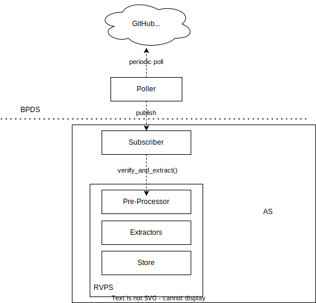

# Reference Values


As [the trust model](https://github.com/confidential-containers/documentation/blob/main/trust_model.md)  declares, the trust boundary of
CoCo is the boundary of TEE. All the software provided by CSP should be trusted. The measurements of the softwares will be calculated
by hardware-TEE when loaded and included in a software evidence (s.t. quote). As users of CoCo, they must verify the evidence by matching
gathered measurements and reference values of the software componants.

This document will show how reference values are generated and used in CoCo/AS.

A `reference value` is a `expected measurement` for TEE evidence, containing both hardware
evidence and software evidences. 

## Software Reference Values

A software reference value is an expected measurement for a specific software componant.

### Intel TDX

In Intel-TDX, kernel, kernel parameter, guest firmware and rootfs will all be measured. Tools are
provided to calculate the reference value for a given binary.


|Componant name|Key of the parsed claims in evidence | Measurement Type | Tool to reference value | Verification Policy|
|---|---|---|---|---|
|Kernel| `"tdx-kernel-size<KERNEL_SIZE-defined-in-td-shim>"` | [`Payload` in CcEventLog](), a sha384 digest | https://github.com/confidential-containers/td-shim/tree/main/td-shim-tools/src/bin/td-payload-reference-calculator | Compare the reference sha384 digest and the evidence|
| Kernel Parameter | `"tdx-kernel-parameter"` | [`Payload` in CcEventLog](), a string or a sha384 digest | https://github.com/confidential-containers/td-shim/tree/main/td-shim-tools/src/bin/td-payload-reference-calculator| Compare the reference sha384 digest and the evidence/ Compare the parameter items parsed from CCEL in evidence with reference parameter items |
| Guest Firmware | `"tdx-mrtd"` | MRTD field in TDX quote | https://github.com/confidential-containers/td-shim/tree/main/td-shim-tools/src/bin/td-shim-tee-info-hash | Compare the reference MRTD and the evidence |
| Rootfs | - | Item `cc_rootfs_verity.hash` in kernel parameter | - | Same as Kernel Parameter | 


### SEV-SNP

TODO

## Reference Value Generation

To follow the trust model, users have three typical scenarios to generate reference values:
|Scenarios | How users can got reference values| Trust relationship |
|---|---|---|
|CSP uses __reproducibly built__-able componants| User builds the artifacts (artifacts here means the same as software, usually indicates binaries or files) and calculate the reference values by themselves| Users only trust the source code by __code transparency__ |
|CSP uses a user-provided componants| User builds the artifacts (artifacts here means the same as software, usually indicates binaries or files) and calculate the reference values all by themselves | Users trust themselves |
|CSP uses componants provided by a third party| Users download reference values provided by the the third party | Users trust the third party |

For the first scenario, reproducible build is not totally supported for CoCo stack now.

The second scenario, we have listed the related tools to calculate the reference values. Users can build the binaries and calculate the reference values themselves.

This section and the following describe the third scenario. In this scenario CoCo community can play a role of the trusted third party.

Totally, we will accomplish the generation of the reference values in the following steps:

1. CoCo community compiles customized guest os image, kernel, guest firmware, etc.
2. CoCo community signs the compiled binaries using sigstore.
3. CoCo publishes the binaries on every new release, the release cycle is TODO.
4. CoCo community calculates the reference values of the artifacts using related tool and then publishes them into repo `https://github.com/confidential-containers/provenances/<release-number>/<architecture>-reference-values.json`.

### Format of Reference Values JSON -- Simple Payload

The Reference Value JSON should follow the following format, named `Simple Payload`

```json
{
    "<key-1-of-the-parsed-claims-in-evidence>": "<reference-value>"
    ...
}
```

For example, `https://github.com/confidential-containers/provenances/0.0.0/tdx-reference-values.json`
might be

```json
{
    "tdx-kernel-size0x10000000": "5b7aa6572f649714ff00b6a2b9170516a068fd1a0ba72aa8de27574131d454e6396d3bfa1727d9baf421618a942977fa",
    "tdx-kernel-parameter": "64ed1e5a47e8632f80faf428465bd987af3e8e4ceb10a5a9f387b6302e30f4993bded2331f0691c4a38ad34e4cbbc627",
    ...
}
```

## Reference Value Consumption

When reference values are published, Attestation Service can get and consume them in the following steps:

1. A componant `Poller` will regularly access the `https://github.com/confidential-containers/provenances/` repo to check whether new versions of reference values are published.
2. If so, the `Poller` will download them, and __publish__ the reference values to [RVPS](../src/rvps/).
3. RVPS will verify and extract the reference values, and store them.

When AS receives a new Remote Attestation request, it will verify the hardware part of the evidence, and parse the claims in the evidence. Then, AS will request RVPS for specific claim key's reference value, and
try to match them.

## Reference Value Provider Service

Reference Value Provider Service, RVPS for short is a componant to receive software supply chain provenances,
verify them and extract the reference values. All the reference values will be stored inside RVPS. When AS
queries specific software [claims](https://github.com/confidential-containers/attestation-service/blob/main/src/types.rs#L4), RVPS will response with related reference values.

### Architecture

The base information stream through RVPS Core is as



### Componants

- Subscriber : Receives the Messages published from BPDS.

- Pre-Processor : Pre-Processor contains a set of Wares (like Middleware). The Wares can
process the input Message and then deliver it to the Extractors.

- Extractors : Extractors has sub-modules to process different type of provenance.
Each sub-module will consume the input Message, and then generate
an output Reference Value.

- Store : Store is a trait object, which can provide `set` and `get` function.
All verified reference values will be stored in the Store. When requested
by Attestation Service, related reference value will be provided.

### Protocols

#### Message

A protocol helps to distribute provenance of binaries. It will be received and processed
by RVPS, then RVPS will generate Reference Value if working correctly. 

```
{
    "version": <VERSION-NUMBER-STRING>,
    "type": <TYPE-OF-THE-PROVENANCE-STRING>,
    "provenance": #provenance,
}
```

The `"version"` field is the version of this message, making extensibility possible.

The `"type"` field specifies the concrete type of the provenance the message carries.

The `"provenance"` field is the main content passed to RVPS. This field contains the payload to be decrypted by RVPS. 
The meaning of the provenance depends on the type and concrete Extractor which process this.

#### Reference Value

A protocol that will be consumed by AS. A Reference Value may contain various fields,
so the implementation is a HashMap. Developers can freely add new fields in it to 
support different scenarios. 

```json
{
    "version" : "<REFERENCE_VALUE_VERSION>",
    "name" : "<NAME-OF-THE-ARTIFACT>",
    "reference-values" : [
        "value1",
        "value2",
        ...
    ],
    "expired":"<EXPIRED-TIME>"
}
```
The default value of `"version"` is `0.1.0`.
